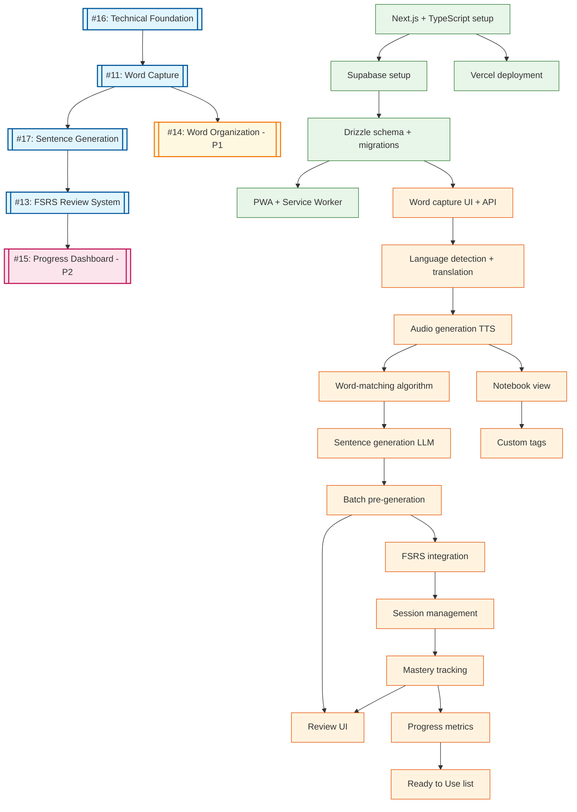

# Dependency Graph

## GitHub Issue Mapping

| Epic | Issue # | Title | Priority |
|------|---------|-------|----------|
| Epic 0 | [#16](https://github.com/ksimons29/learnthelanguageyoulivein/issues/16) | Technical Foundation | P0 |
| Epic 1 | [#11](https://github.com/ksimons29/learnthelanguageyoulivein/issues/11) | Word Capture | P0 |
| Epic 2 | [#17](https://github.com/ksimons29/learnthelanguageyoulivein/issues/17) | Dynamic Sentence Generation | P0 |
| Epic 3 | [#13](https://github.com/ksimons29/learnthelanguageyoulivein/issues/13) | FSRS Review System | P0 |
| Epic 4 | [#14](https://github.com/ksimons29/learnthelanguageyoulivein/issues/14) | Word Organization | P1 |
| Epic 5 | [#15](https://github.com/ksimons29/learnthelanguageyoulivein/issues/15) | Progress Dashboard | P2 |



## Legend
- **Blue epics**: P0 - Must have for MVP
- **Yellow epics**: P1 - Should have (can ship without)
- **Pink epics**: P2 - Nice to have
- **Green tasks**: Foundation/infrastructure
- **Orange tasks**: Feature tasks
- **Arrows**: Dependency flow (A → B means B depends on A)

## MVP Critical Path

The minimum path to a working product:

```
#16 Foundation → #11 Word Capture → #17 Sentence Generation → #13 FSRS Review
     E0        →       E1         →         E2              →       E3
```

**P1/P2 features can be deferred:**
- #14 Word Organization (P1) - Can ship without, users still get core learning loop
- #15 Progress Dashboard (P2) - Can ship without, add post-launch

## Parallel Development Opportunities

After completing each milestone, the following can run in parallel:

| After | Can Parallelize |
|-------|-----------------|
| Epic 0 | T0.4 (Vercel) and T0.5 (PWA) |
| Epic 1 | E2 (Sentences) AND E4 (Organization) |
| Epic 2 | T3.1-T3.3 (FSRS logic) AND T3.4 (Review UI) |

## Task Breakdown by Epic

### Epic 0: Technical Foundation (#16)
| Task | Description | Estimated |
|------|-------------|-----------|
| T0.1 | Next.js 14+ with TypeScript, Tailwind, shadcn/ui | 4h |
| T0.2 | Supabase project (db, auth, storage) | 4h |
| T0.3 | Drizzle ORM schema and migrations | 8h |
| T0.4 | Vercel deployment pipeline | 2h |
| T0.5 | PWA manifest + Service Worker setup | 4h |
| **Subtotal** | | **22h** |

### Epic 1: Word Capture (#11)
| Task | Description | Estimated |
|------|-------------|-----------|
| T1.1 | Word capture UI and POST /api/words | 12h |
| T1.2 | Language detection + translation via OpenAI | 8h |
| T1.3 | TTS audio generation + Supabase Storage | 8h |
| **Subtotal** | | **28h** |

### Epic 2: Dynamic Sentence Generation (#17)
| Task | Description | Estimated |
|------|-------------|-----------|
| T2.1 | Word-matching algorithm (category + timing) | 16h |
| T2.2 | Sentence generation via GPT-4 | 12h |
| T2.3 | Batch pre-generation system | 10h |
| **Subtotal** | | **38h** |

### Epic 3: FSRS Review System (#13)
| Task | Description | Estimated |
|------|-------------|-----------|
| T3.1 | ts-fsrs integration, 4-point rating | 16h |
| T3.2 | Session management (2h boundary) | 8h |
| T3.3 | Mastery tracking (3 correct sessions) | 8h |
| T3.4 | Review UI (exercise types, feedback) | 20h |
| **Subtotal** | | **52h** |

### Epic 4: Word Organization (#14) - P1
| Task | Description | Estimated |
|------|-------------|-----------|
| T4.1 | Notebook view by category | 12h |
| T4.2 | Custom tags CRUD | 8h |
| **Subtotal** | | **20h** |

### Epic 5: Progress Dashboard (#15) - P2
| Task | Description | Estimated |
|------|-------------|-----------|
| T5.1 | Progress metrics calculation | 12h |
| T5.2 | Ready to Use list + celebration | 6h |
| **Subtotal** | | **18h** |

## Effort Summary

| Priority | Epics | Hours |
|----------|-------|-------|
| **P0 (MVP Required)** | E0 + E1 + E2 + E3 | **140h** |
| P1 (Should Have) | E4 | 20h |
| P2 (Nice to Have) | E5 | 18h |
| **Total** | All | **178h** |

## Closed/Obsolete Issues

The following issues were closed as obsolete or superseded:

| Issue | Reason |
|-------|--------|
| #1 | Expo bootstrap → Now using Next.js |
| #2 | Basic screens → Covered by individual epics |
| #3 | SQLite → Now using Supabase PostgreSQL |
| #4 | SRS v1 → Superseded by #13 (FSRS) |
| #5 | Review UI → Superseded by #13 (T3.4) |
| #6 | Import phrases → Deferred, MVP is text input only |
| #7 | Export backup → Deferred to V1.1 |
| #8 | Vercel deploy → Covered by #16 (T0.4) |
| #9 | iPhone distribution → Deferred to V2 |
| #10 | Sync strategy → Handled by Supabase |
| #12 | Smart Card → Merged into Word entity |
