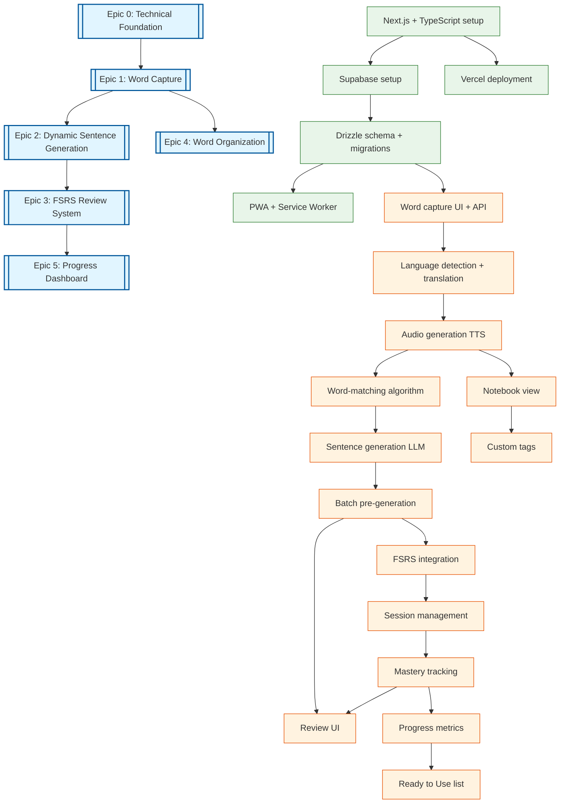

# Dependency Graph



## Legend
- **Double box (blue)**: Epic - major feature or component
- **Single box (orange)**: Feature task
- **Single box (green)**: Foundation/infrastructure task
- **Arrow direction**: Dependency flow (A → B means B depends on A)

## Epic Dependencies Summary

| Epic | Depends On | Blocking |
|------|------------|----------|
| E0: Foundation | - | E1 |
| E1: Word Capture | E0 | E2, E4 |
| E2: Sentence Generation | E1 | E3 |
| E3: FSRS Review | E2 | E5 |
| E4: Organization | E1 | - |
| E5: Progress | E3 | - |

## Critical Path

The critical path for MVP delivery:

```
Foundation → Word Capture → Sentence Generation → FSRS Review → Progress
   E0      →      E1      →        E2          →      E3     →    E5
```

**Parallel work possible:**
- E4 (Organization) can be developed in parallel with E2/E3 after E1 completes
- T3.4 (Review UI) can be developed in parallel with T3.1-T3.3

## Task Breakdown

### Epic 0: Technical Foundation
| Task | Description | Estimated |
|------|-------------|-----------|
| T0.1 | Next.js 14+ with TypeScript, Tailwind, shadcn/ui | 4h |
| T0.2 | Supabase project (db, auth, storage) | 4h |
| T0.3 | Drizzle ORM schema and migrations | 8h |
| T0.4 | Vercel deployment pipeline | 2h |
| T0.5 | PWA manifest + Service Worker setup | 4h |

### Epic 1: Word Capture
| Task | Description | Estimated |
|------|-------------|-----------|
| T1.1 | Word capture UI and POST /api/words | 12h |
| T1.2 | Language detection + translation via OpenAI | 8h |
| T1.3 | TTS audio generation + Supabase Storage | 8h |

### Epic 2: Dynamic Sentence Generation
| Task | Description | Estimated |
|------|-------------|-----------|
| T2.1 | Word-matching algorithm (category + timing) | 16h |
| T2.2 | Sentence generation via GPT-4 | 12h |
| T2.3 | Batch pre-generation system | 10h |

### Epic 3: FSRS Review System
| Task | Description | Estimated |
|------|-------------|-----------|
| T3.1 | ts-fsrs integration, 4-point rating | 16h |
| T3.2 | Session management (2h boundary) | 8h |
| T3.3 | Mastery tracking (3 correct sessions) | 8h |
| T3.4 | Review UI (exercise types, feedback) | 20h |

### Epic 4: Word Organization
| Task | Description | Estimated |
|------|-------------|-----------|
| T4.1 | Notebook view by category | 12h |
| T4.2 | Custom tags CRUD | 8h |

### Epic 5: Progress Dashboard
| Task | Description | Estimated |
|------|-------------|-----------|
| T5.1 | Progress metrics calculation | 12h |
| T5.2 | Ready to Use list + celebration | 6h |

## Total Estimated Effort

| Epic | Hours |
|------|-------|
| E0: Foundation | 22h |
| E1: Word Capture | 28h |
| E2: Sentence Generation | 38h |
| E3: FSRS Review | 52h |
| E4: Organization | 20h |
| E5: Progress | 18h |
| **Total** | **178h** |
